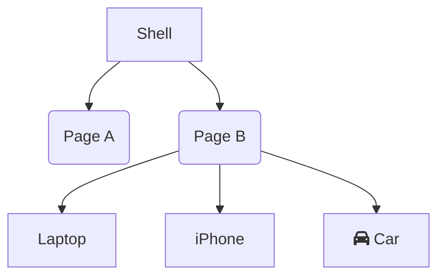

# AnalogJS


The full-stack Angular meta-framework


## Hi, my name is
- Benjamin Legrand ( @benjilegnard )
- Tech Lead ( onepoint )
- Angular/Typescript/Node


## Plan
- c'est quoi un meta framework
- les features
-


## Introduction


### Wait wat?

- What is a meta-framework ?
- Terms & definitions


### Take your client-only libs

- Angular
- React
- Vue
- Svelte
- Qwik


### Put them on a server

- Angular + Analog
- React + Next
- Vue + Nuxt
- Svelte + SvelteKit
- Qwik + Qwik City
---
## Joke
Y U NO NGXT ?


### Advantages

Same code on the server and on the client
Used to render the page.


## Inconvenients


## Meta-frameworks:<br/> the good parts


## Meta-frameworks:<br/> the bad parts

- file base routing kinda sucks
- index.page.tsx everywhere
- 


## Let's define some terms

- SSR - Server Side Rendering
- SSG - Static Site Generation
- Hydration
- Jamstack


## Features


### Vite / Vitest / Playwright


### File-based routing


#### Example



### Markdown as content routes
```typescript
import { Component } from '@angular/core';

@Component({
  standalone: true,
  template: ` <h2>Welcome</h2> `,
})
export default class HomePageComponent {}
```

### Hybrid SSR/SSG


### Api routes / server


## Demo


---


## Questions


## Thank you
