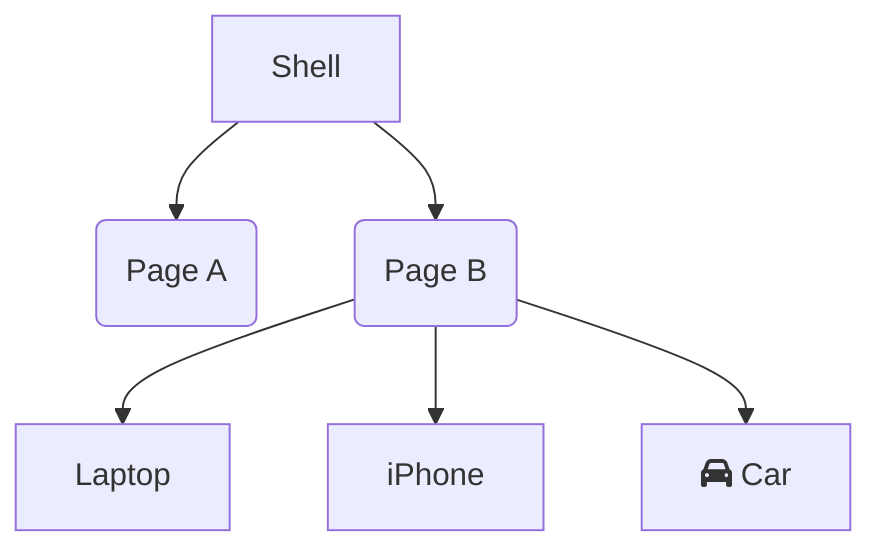

# AnalogJS


The full-stack Angular meta-framework


## Hi, my name is
<div class="row">


- Benjamin Legrand <br> [@benjilegnard](https://twitter.com/benjilegnard)
- Tech Lead ( onepoint )
- Angular/Typescript/Node
</div>


## Analog.JS
<div class="row">


- Brandon Roberts [@brandontroberts](https://twitter.com/brandontroberts)
- NGRX contributor
- Angular GDE
</div>
---
Auteur d'analogJS
Contributeur ngrx


## Plan
- c'est quoi un meta-framework ?
- les features d'analogjs
- h3 / nitro
---
démo peut-être


## Introduction


### Wait, wat?

- What is a meta-framework ?
- Terms & definitions
- SSR, SSG, CSR, WTF, BBQ.


### SSR
- Server-Side Rendering
---
- Rendu serveur
- historiquement on a toujours fait ca


### CSR
- Client Side Rendering


---
- On distingue du SSR: c'est le browser qui fait la génération du HTML.


### SPA
- Single Page Application
---
- Historiquement: client-side only
- ne veut pas dire qu'on fait qu'une seule page


#### MPA


#### SPA


### SSG
- Static Site Generation


---
Conclusion:
- Analog nous permets de faire tout ca, du rendu serveur, des spa angular, de la génération de sites statiques


## Meta-framework ?


### Qu'est ce que c'est ?


#### Take your client-only libs

- Angular
- React
- Vue
- Svelte
- Qwik


#### Put them on a server

- Angular + Analog
- React + Next
- Vue + Nuxt
- Svelte + SvelteKit
- Qwik + Qwik City
---
## Joke
Y U NO NGXT ?


### Add some features
- accès à requête / réponse
- routage "universel"<!-- .element: class="fragment" -->
- file-based routing<!-- .element: class="fragment" -->
- routes d'api<!-- .element: class="fragment" -->


### Avantages / Inconvénients


#### Meta-frameworks:<br/> the good parts

- Même code / composants <br/> entre serveur et client<!-- .element: class="fragment" -->
- Navigations full page et SPA.<!-- .element: class="fragment" -->
- Bénéfices du CSR et du SSR<!-- .element: class="fragment" -->
---
- surtout important on évite le contexte switch
- on évite d'avoir du rendu fait serveur différent de coté client


#### Meta-frameworks:<br/> the bad parts

- file-based routing can be hard:
```bash
.
├── checkout
│   ├── basket
│   │   └── page.tsx
│   ├── cart
│   │   └── page.tsx
│   └── summary
│       └── page.tsx
├── home
│   └── page.tsx
└── products
    ├── [id]
    │   └── page.tsx
    └── page.tsx
```
---
- index.page.tsx everywhere


#### Meta-frameworks:<br/> the bad parts

- abstractions<!-- .element: class="fragment" -->
- vendor-locking<!-- .element: class="fragment" -->
---
- abstractions bizarres
- use client / use server
- code spécifiques a la solution


## AnalogJS Features


### Vite / Vitest / Playwright
- analogjs is a vite plugin
- everything is a vite plugin
- nx libs integration
- e2e with playwright
---
Vite est un bundler nouvelle génération, vient du monde vue, mais est utilisable un peu partout.
- utilise esbuild et rollup en dessous


`vite.config.ts`
```ts
// todo vite config

```


### File-based routing

```
.
├── checkout
│   ├── basket.page.ts
│   ├── cart.page.ts
│   └── summary.page.ts
├── home.page.ts
├── (layout).page.ts
└── products
    ├── [id].page.ts
    └── (list).page.tsx
```


#### Example


#### Dynamic routes from folder tree


#### Path params

- \[myParam\].page.ts


#### Ghost page /

- `path.page.ts`: /path
- `path/index.page.ts` : /path
- `path/(path).page.ts` : /path
---
- les deux sont équivalents 


#### Page component type
- export default
`home.page.ts`
```typescript
import { Component } from '@angular/core';

@Component({
  standalone: true,
  template: ` <h2>Welcome</h2> `,
})
export default class HomePage {}
```


#### Page metadata
```ts
export const meta: RouteMeta = {
  // canActivate, canMatch, guard, resolvers, providers etc...
}

@Component({/** */})
export default class PathPage {}
```


### Markdown as content routes

`src/content/*`
```bash
src
├── app 
├── content
│   ├── mon-contenu.md
│   └── en-format-markdown.md
└── pages
```


#### Front-matter

```markdown
---
publishedDate: '2024-01-09'
slug: mon-super-article
meta:
  tags:
    - yaml
---

## titre
```


#### Mermaid support

#### Example



#### 


### Hybrid SSR/SSG

// TODO


### Api routes / server
---
de la même manière que pour 


#### h3 / nitro


## Demo


## One more thing...

new component authoring format
- [Discussion github](https://github.com/analogjs/analog/discussions/824)
---
- Vu qu'analog utilise déja le compilateur angular.
- C'est tout frais, semaine dernière


### .ng files
`hello.ng`
```html
<template>
  <p>hello works!</p>
</template>
```


### ts in .ng
```html
<script lang="ts">
  import { signal } from '@angular/core';

  const counter = signal(1);

  const increment = () => {
    counter.update((value) => value + 1);
  };

  function decrement() {
    counter.update((value) => value - 1);
  }
</script>
<template>
  <p>Counter: {{ counter() }}</p>
  <button (click)="increment()">increment</button>
  <button (click)="decrement()">decrement</button>
</template>
<style>
  p { color: red }
</style>
```


### ts in .ng
```html
<script lang="ts">
  import { inject, signal, effect, computed } from '@angular/core';
  import { JsonPipe } from '@angular/common';
  import { HttpClient } from '@angular/common/http';
  import { delay } from 'rxjs';

  import Hello from './hello.ng';
  import Highlight from './highlight.ng';
  import Doubled from './doubled.ng';

  defineMetadata({
    selector: 'app-root',
    imports: [JsonPipe],
  });

  const title = 'Analog';

  const http = inject(HttpClient);

  const counter = signal(1);
  const doubled = computed(() => counter() * 2);
  const todo = signal(null);

  const increment = () => {
    counter.update((value) => value + 1);
  };

  function decrement() {
    counter.update((value) => value - 1);
  }

  effect(() => {
    console.log('counter changed', counter());
  });

  onInit(() => {
    console.log('App init');
    http
      .get('https://jsonplaceholder.typicode.com/todos/1')
      .pipe(delay(2000))
      .subscribe((data) => {
        todo.set(data);
        console.log('data', data);
      });
  });
</script>

<template>
  @if (counter() > 2) {
    <Hello />
  }

  <p>Counter: {{ counter() }}</p>
  <p highlight>Doubled: {{ doubled() }}</p>
  <p>Doubled with Pipe: {{ counter() | doubled }}</p>
  <button (click)="increment()">increment</button>
  <button (click)="decrement()">decrement</button>

  @if (todo(); as todo) {
  <pre>{{todo | json }}</pre>
  } @else {
  <p>Loading todo...</p>
  }
</template>

<style>
  p {
    color: red;
  }
</style>
```


### Vue.js called

They want their shirt back.


### Experimental !

```typescript [,11]
import { defineConfig } from 'vite';
import analog from '@analogjs/platform';

export default defineConfig(({ mode }) => ({
  // ... other config
  plugins: [
    analog({
      ssr: false,
      vite: {
        experimental: {
          dangerouslySupportNgFormat: true
        }
      },
    }),
  ],
}));
```


## Conclusion

cas d'usage ou AnalogJS est intéressant
---
- quand déja une base angular
- compatible nx
- certaines partie de l'appli
- sites institutionnel, FAQ / CMS / blogs / docs


### Cycle de vie de la donnée
- mise en cache
- péremption
- tout
---
Cas d'usage ou AnalogJS est intéréssant
- dépends du cycle de vie de 


## Questions

?

## Thank you
