# AnalogJS


The full-stack Angular meta-framework


## Hi, my name is
<div class="row">


- Benjamin Legrand <br> [@benjilegnard](https://twitter.com/benjilegnard)
- Tech Lead ([@onepoint](https://www.groupeonepoint.com/))
- Angular/Typescript/Node
</div>
---
- Tech Lead chez Onepoint, viendez au stand
- Expert Angular / Typescript / Node
- Dans une autre vie, je faisais du java.


## Analog.JS 🔺
<div class="row">


- Brandon Roberts [@brandontroberts](https://twitter.com/brandontroberts)
- NGRX contributor
- Angular GDE
</div>
---
Auteur d'analogJS
Contributeur ngrx


## Plan 🗺️
- c'est quoi un meta-framework ?<!-- .element: class="fragment" -->
- (re)définissons quelques termes<!-- .element: class="fragment" -->
- analogjs features & concepts<!-- .element: class="fragment" -->
- comment fait-il ?<!-- .element: class="fragment" -->
- analogjs : les intégrations<!-- .element: class="fragment" -->
- serveur et options de déploiement<!-- .element: class="fragment" -->
---
- voilà ce dont je vais parler


## Meta-framework ? qu'est-ce que c'est ?

---
Pas la peine dedemander à ChatGPT, de toute facons, il est décédé, je vais vous expliquer.


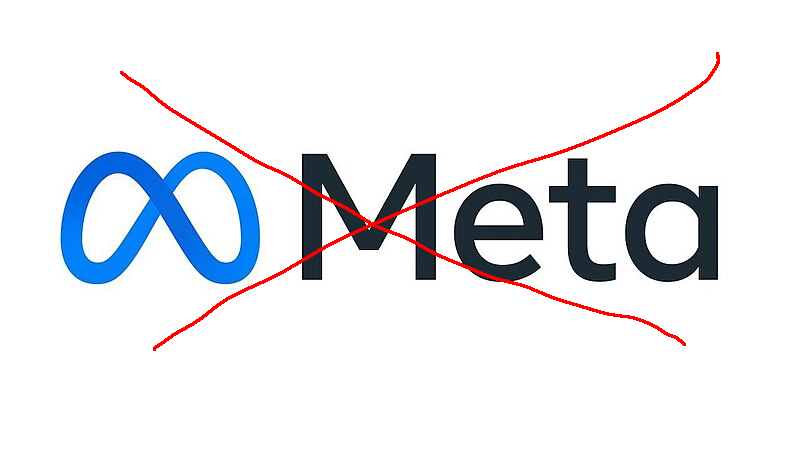
---
- On ne parle pas de meta.
- évidemment, 


### Méta cagoule !
définition:
<blockquote>
Méta est un préfixe qui provient du grec `μετά` (meta) (après, au-delà de, avec)<br/>
Il exprime tout à la fois la réflexion, le changement, la succession, le fait d'aller au-delà, à côté de, entre ou avec. 
</blockquote>


### Méta-barons
<blockquote>Méta est souvent utilisé dans le vocabulaire scientifique pour indiquer l'autoréférence (réflexion), ou pour désigner un niveau d'abstraction supérieur</blockquote>

source: [wikipedia.fr](https://fr.wikipedia.org/wiki/M%C3%A9ta_(pr%C3%A9fixe))

---
- métalanguage, métadonnées
- Selon le contexte, le préfixe équivaut au sens de profond 
- ah, niveau d'abstraction. ça me parle on connait ca en informatique
- donc un meta-framework, c'est un niveau d'abstraction supérieur à un framework.


### Soyons sérieux un instant 

---
- Si vous voulez continuez avec une autre conférence meta ensuite.
- Je vous recommende celle sur les metas-lois de Stéphane Trebel.


### Mais un framework, qu'est-ce que c'est ?
Définition

<blockquote>
Un framework est un ensemble de composants logiciels qui sert à créer les fondations ainsi que les grandes lignes de tout ou d'une partie d'un logiciel (architecture).
</blockquote>


#### Aussi simple que deux et deux font quatre

- Un meta framework, est donc un niveau d'abstraction supérieur à un ensemble de composants logiciels...
---
- Bon bref, vous avez compris l'idée.
- AnalogJS est un meta-framework pour Angular = un niveau d'abstraction supérieur à Angular, lui rajoutant des fonctionnalités diverses et variées.


#### Qu'est ce que c'est ? vraiment.
---
- Bon plus simplement et dans notre contexte.
- AnalogJS est un meta-framework pour angular ( ca veut toujours rien dire )
- Dans le domaine du web, on a déjà des examples de meta-frameworks


#### On prends des librairies "client"
| Framework |
| --------- |
| Angular   |
| React     |
| Vue       |
| Svelte    |
| Solid     |
| Qwik      |
---
- Prenons quelques example de framework front. De base, ils sont tous client-side, ils sont fait pour faire des SPA
- Oui, j'ai mis React là dedans, et Qwik, mais on s'en fiche, suivez moi.


#### Et on leur ajoute une dimension serveur.
| Framework |   | Meta-framework |
| --------- | - | -------------- |
| Angular   | + | AnalogJS       |
| React     | + | Next.js        |
| React     | + | Remix          |
| Vue       | + | Nuxt           |
| Svelte    | + | SvelteKit      |
| Solid     | + | SolidStart     |
| Qwik      | + | Qwik City      |
---
- Y U NO NGXT ?
- Toutes ces solutions sont couplées à la librairie de base pour fournir des fonctionnalités supplémentaires.


### Ajout de nouvelles fonctionnalités:
- 📋 accès aux requêtes / réponses HTTP<!-- .element: class="fragment" -->
- 🚏 routage "universel"<!-- .element: class="fragment" -->
- 📂 file-based routing<!-- .element: class="fragment" -->
- 🏋️‍♂️ capacités "full-stack" (api routes)<!-- .element: class="fragment" -->

---
Maintenant qu'on est côté serveur,
- on a accès à la requête / réponse HTTP 
- le routage doit être universel, c'est à dire, doit fonctionner coté serveur et coté client 
- file-based routing, c'est à dire, on définit nos routes en fonction de l'arborescence des fichiers
- une composante serveur en plus
- voyons les avantages et inconvénients.


### Meta-frameworks:<br/> the good parts
- 🧑‍🤝‍🧑 Même code & composants entre serveur et client<!-- .element: class="fragment" -->
- ⛵ Navigations full page et SPA.<!-- .element: class="fragment" -->
- 💰 Bénéfices du CSR et du SSR<!-- .element: class="fragment" -->
- 🏋️ full-stack apps<!-- .element: class="fragment" -->

---
- surtout important on évite le contexte switching
- on évite d'avoir du rendu fait serveur différent de coté client


### Meta-frameworks:<br/> the bad parts

- file-based routing :
```bash
.
├── checkout
│   ├── basket
│   │   └── page.tsx
│   ├── cart
│   │   └── page.tsx
│   └── summary
│       └── page.tsx
├── home
│   └── page.tsx
└── products
    ├── [id]
    │   └── page.tsx
    └── page.tsx
```
---
- index.page.tsx everywhere
- critiques surtout faites à Next.js
- "une des critiques" mais je pre-shot : n'est pas pertinent en analogjs, on va voir pourquoi


#### Woking on a Next.js 13 project be like


source: [reddit](https://www.reddit.com/r/nextjs/comments/147pvkw/working_on_a_nextjs_13_project_be_like/)


## Est ce qu'Angular a besoin d'un meta-framework ?


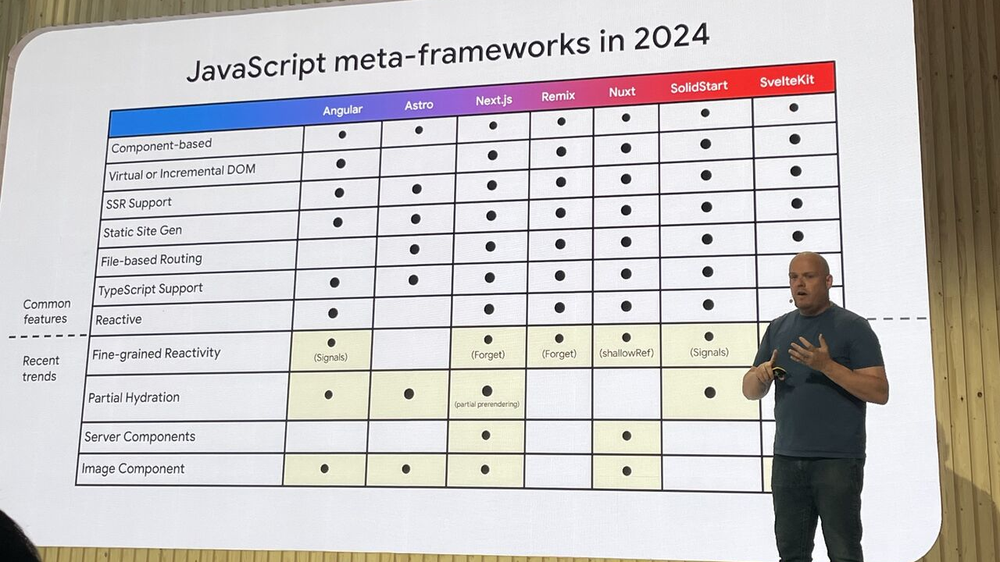

source: [Lamis Chebbi on linkedin](https://www.linkedin.com/posts/lamis-chebbi-026368ab_googleioconnect2024-javascript-webdevelopment-activity-7212424947657306116-ia-Z)
---
- Google IO Connect 2024
- à l'horizontale : Angular / Astro / Next / Remix / Nuxt / SolidStart / SvelteKit
- Angular est un déjà classable dans les meta-framework complet
- à la verticale : component-base / virtual dom / SSR support / SSG / TS Reactive / Hydration / Image Components
- seules fonctionnalités manquantes: file-based routing et "server components"


### Angular is a platform.
- Yes, but...
- Pas d'opinions sur l'hébergement.
- SSR is kinda... painful <span class="fragment">( for now )</span><span class="fragment">( but it's getting better )</span>
---
- autant on peut dire qu'angular est opinioné, sur l'hébergement, pas trop
- on est un peu livré à nous même
- Donc bon, la question se pose, j'ai pas vraiment de réponse, donc j'ai envie de dire...


### Est-ce que Angular a besoin d'un meta-framework ?
- peut-être bien que oui
- peut-être bien que non
---
- à vous de vous faire votre avis après ce que je vais vous présenter
- AnalogJS est un meta-framework pour Angular
- Qui nous apporte pas mal de fonctionnalités plutôt sympas


### AnalogJS 
- features de meta-framework
- \+ developer experience
- \+ facilite le SSR / SSG / CSR /SPA
---
- Bon ça fait beaucoup de sigles, donc avant d'attaquer les features.
- Et pourquoi c'est bien qu'on puisse faire tout ça ?
- on va dire les termes comme disent les jeunes.


## (re-)définissons quelques termes.

- SPA, SSR, SSG, CSR, WTF, BBQ.


### SPA: Single Page Application
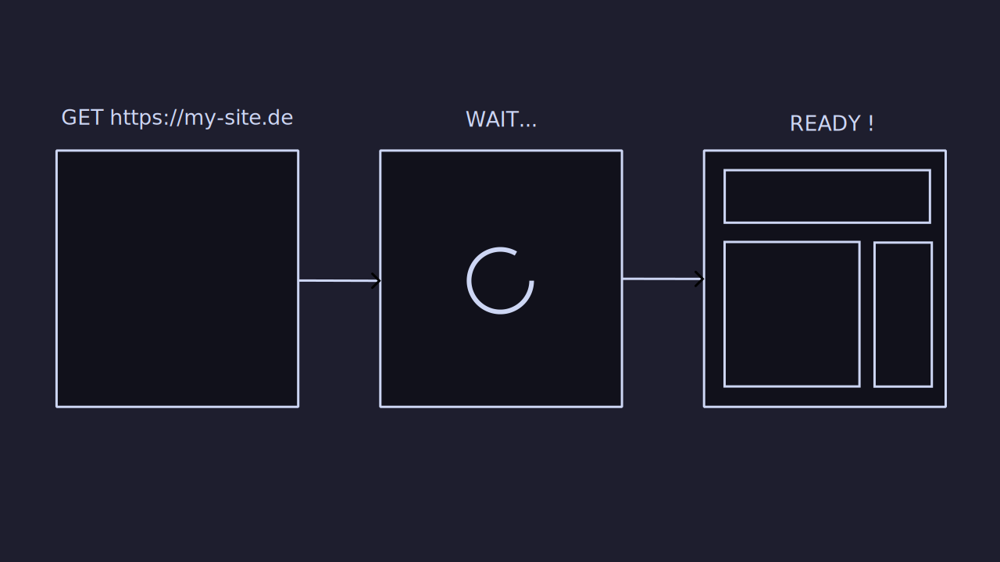
---
- Historiquement: client-side only
- ne veut pas dire qu'on fait qu'une seule page


### CSR: Client-Side Rendering 

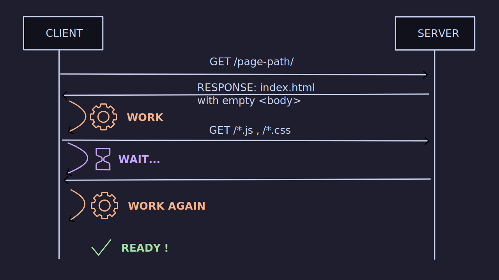


### SSR: Server-Side Rendering
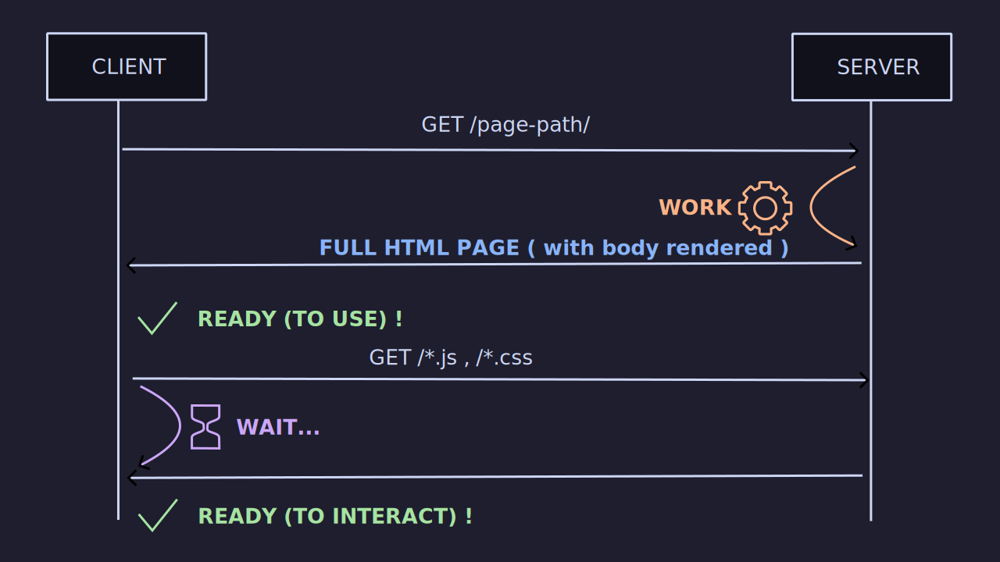
---
- Rendu serveur
- historiquement on a toujours fait ca
- MPA: multi-page application


### SSG: Static Site Generation
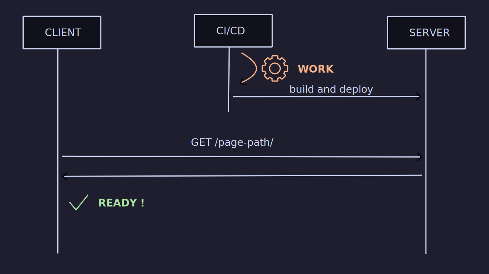
---
- Génération de site statique 
- ici c'est votre pipeline de déploiement qui génère les pages
- pas de serveur "dynamique" avec bdd et tout, juste des fichiers html
- permets d'avoir des serveurs "stupides" ou plus politiquement correct: statiques (nginx, apache, S3 etc...)
- En Conclusion:
- Analog nous permets de faire tout ca, du rendu serveur, des spa angular, de la génération de sites statiques


## AnalogJS Features & Concepts


### File-based routing

```no-highlight
src/app/pages
├── checkout
│   ├── (checkout).page.ts
│   ├── basket.page.ts
│   ├── cart.page.ts
│   └── summary.page.ts
├── home.page.ts
├── (layout).page.ts
└── products
    ├── [id].page.ts
    └── (list).page.ts
```
---
- chaque fichier .ts contient un composant routés
- le répertoire pages est une convention.
- notez les crochets et parenthèse


#### Donne ce routage, avec ces URLs
```
/home
/products
/products/{id}
/checkout/basket
/checkout/cart
/checkout/summary
```
---
- C'est le nommage des fichiers qui a définit nos routes,
- analogjs va lire les fichiers et les transformer en routes angular


#### Path params

- \[myParam\].page.ts
---
permet de paramétriser votre chemin, ensuite input routé dans le composant


#### Pathless page component

- `path.page.ts` => `/path`
- `path/index.page.ts` => `/path`
- `path/(path).page.ts` => `/path`
---
- les trois sont équivalents 


#### Analog va recréer un arbre de routage.
```typescript
const appRoutes: Route[] = [
  {
    path: '',
    component: LayoutPage, // layout.page.ts
    children: [
      {
        path: 'checkout',
        component: CheckoutPage, // checkout/(checkout).page.ts
        children:
        [
          // etc...
        ] 
      }
    ]
  }
]
```
---
- ça c'est ce que vous auriez du écrire en angular "standard"
- en interne, analogjs reconstruit l'arbre de routage et les chemin pour angular
- vous n'avez plus besoin de ces définitions


#### Page component type
`home.page.ts`
```typescript [|7]
import { Component } from '@angular/core';

@Component({
  standalone: true,
  template: ` <h2>Welcome</h2> `,
})
export default class HomePage {}
```
---
- notez le export default
- vu que vous ne déclarez plus quel composant est routé, il faut que ca soit l'export par défaut pour qu'analog fasse le lien entre fichier de page et composant
- vous me direz : tout seul, ce n'est pas suffisant pour reproduire toutes les possibilités du routeur angular.
- et vous auriez raison:


#### Page metadata
```ts
export const meta: RouteMeta = {
  // guards: canActivate, canMatch, etc...
  // data, resolvers, providers etc...
}

@Component({/** */})
export default class HomePage {}
```
---
- On peut retrouver toute l'API du routeur grâce à cette balise meta
- avantage : la définition de la route est proche de la définition du composant
- "elle est le composant"


#### Pre-shot des critiques
- 🌐 Une URL, c'est déjà un chemin vers une arborescence de fichiers<!-- .element: class="fragment" -->
- 🗂️ Organiser ses composants routés par url = une seule source de vérité<!-- .element: class="fragment" -->
- 🚚 Ne veut pas dire "mettre tous nos composants dans un seul répertoire de page"<!-- .element: class="fragment" -->
---
- Organisez vous bien.
- Ne mettez pas tout dans un seul répertoire de page
- la feature-oriented architecture, c'est bon, mangez-en
- passons à la deuxième grosse feature d'analog:


### Markdown as content routes

`src/content/*`
```bash
src
├── app 
├── content
│   ├── mon-premier-article.md
│   └── un-autre-article.md
└── pages
```
---
- Analog donne la possibilité de gérer son contenu en markdown.
- pas besoin de BDD / "jamstack" / SSG.


#### Front-matter

```markdown
---
title: My First Post
slug: 2022-12-27-my-first-post
description: My First Post Description
coverImage: https://example/url-image/png
---

## titre

contenu au format __markdown__
```


#### Markdown component

```typescript [|1|6-11|24-26|18|19]
// /src/app/pages/articles.[slug].page.ts
import { injectContent, MarkdownComponent } from '@analogjs/content';
import { AsyncPipe, NgIf } from '@angular/common';
import { Component } from '@angular/core';

export interface ArticleAttributes {
  title: string;
  slug: string;
  description: string;
  coverImage: string;
}

@Component({
  standalone: true,
  imports: [MarkdownComponent, AsyncPipe, NgIf],
  template: `
    <ng-container *ngIf="article$ | async as article">
      <h1>{{ article.attributes.title }}</h1>
      <analog-markdown [content]="article.content"></analog-markdown>
    </ng-container>
  `,
})
export default class ArticleComponent {
  readonly article$ = injectContent<ArticleAttributes>({
    param: 'slug', 
  });
}
```
---
- les urls vont être `/articles/[slug]` vu le nom du composant
- les données rédigées en front-matter sont récupérables en tant qu'object dans `attributes`
- le contenu markdown de votre fichier, récupéré dans `content` peut ensuitre être transformé en html par le composant `analog-markdown`


### Mermaid support
`app.config.ts`
```typescript
// ...
providers: [
  provideMarkdownRenderer({
    loadMermaid: () => import('mermaid'),
  }),
],
```
---
- transformation markdown, donc possible d'avoir des plugins markdown
- mermaid en est un outil pour faire des diagrammes en javascript.
- lazy-loading de mermaid pour ne pas alourdir le bundle. Ne sera chargé que si nécessaire.


#### Apparté sur Mermaid


---
- c'est une lib javascript pour faire plein de diagrammes différent.
- diagramme as code


##### Flowchart
<div class="row">
<pre style="width:50%"><code class="hljs language-markdown">

</code></pre>
</div>


##### Sequence diagram
<div class="row">
<pre style="width:50%"><code class="hljs language-markdown">
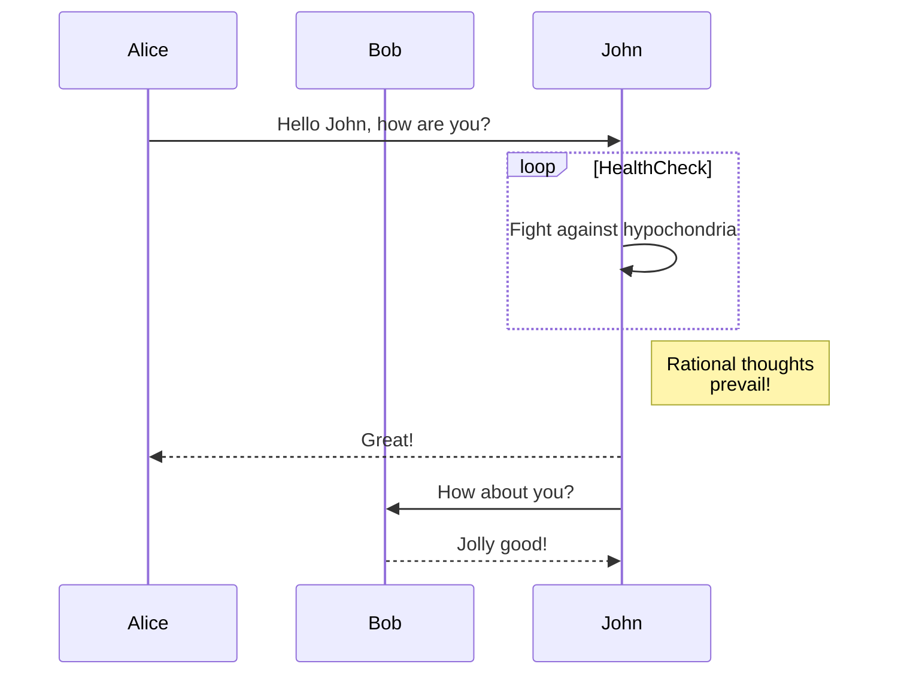
</code></pre>
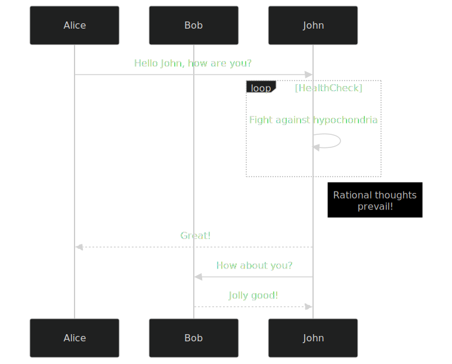
</div>


##### Class diagram

<div class="row">
<pre style="width:50%"><code class="hljs language-markdown" >
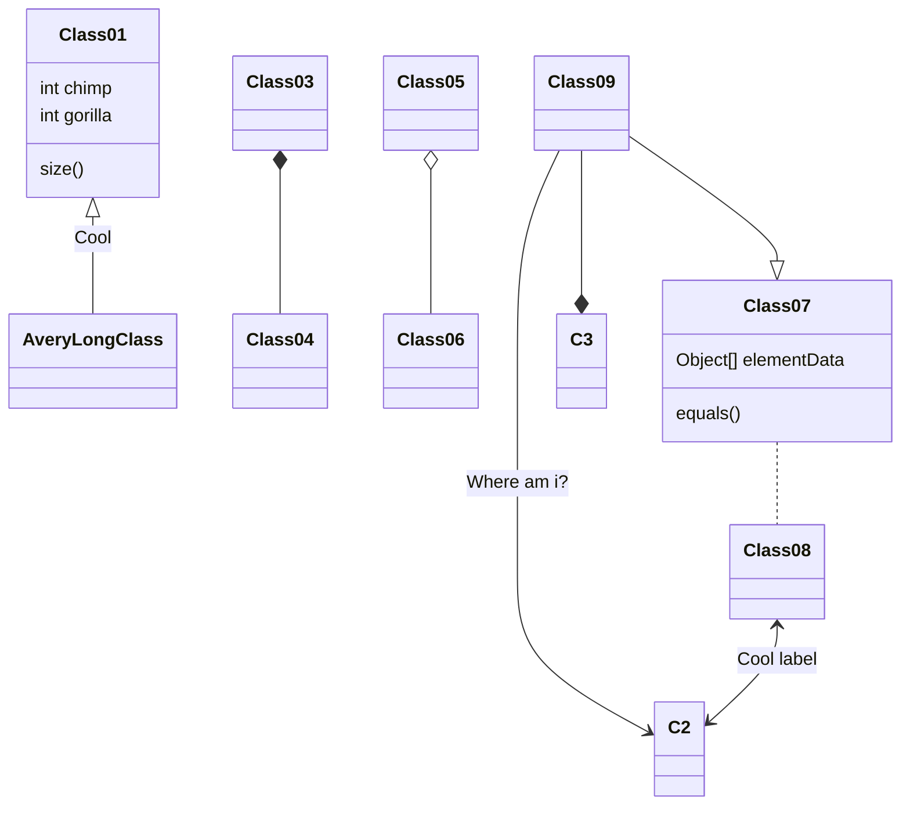
</code></pre>
</div>


##### Et plein d'autres types de diagrammes:
- State diagram
- Gantt
- git commit graph 
- entity relationships
- C4 
- Mindmaps
- Timeline 
- etc...
---
- je vous laisse aller voir la doc de mermaid pour vocabulaire
- pour en revenir à Analog...


### Hybrid SSR/SSG
- Static Site Generation (SSG)
- AND Server Side Rendering (SSR)
---
- AnalogJS permet de faire les deux
- feature qui arrive bientôt dans Angular


```typescript
// ...
    analog({
      prerender: {
        routes: async () => [
          '/',
          '/about',
          '/blog',
          '/blog/posts/2023-02-01-my-first-post',
        ],
      },
    }),
```


### AnalogJS, d'autres features encore:
- coloration syntaxique avec [prismjs](https://prismjs.com/)
- génération de sitemap.xml automatique.<!-- .element: class="fragment" -->
- code generation (schematics).<!-- .element: class="fragment" -->
- open-graph image generation<!-- .element: class="fragment" -->
- server-side-data-fetching<!-- .element: class="fragment" -->
---
- fin des features principales d'analogjs
- server side j'en ai pas parlé parce que j'ai pas encore testé.
- mais ça vous permets de faire de la résolution de données dans des fichiers 


### En bref.
- file-based routing<!-- .element: class="fragment" -->
- markdown as content routes<!-- .element: class="fragment" -->
- mermaid support<!-- .element: class="fragment" -->
- SSR / SSG support<!-- .element: class="fragment" -->
---
- fin des features principales d'analogjs


## Mais comment fait-il donc ?


---
- Comment analogjs fait-il pour faire tout ça ?
- accès aux fichiers, lecture, parsing, etc...
- c'est là qu'on va parler de vite, parce que le secret d'analogjs, c'est vite.


### AnalogJS is a Vite plugin
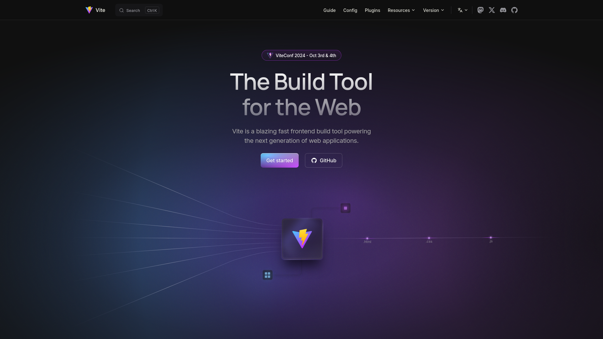

---
- Vite est un bundler nouvelle génération, vient du monde vue, mais est utilisable un peu partout.
- utilise rollup et les modules natifs ESM en dessous


### C'est devenu le défaut ?
`pnpm create vite my-app --template <preset>`
| JavaScript | TypeScript |
| ---------- | ---------- |
| vanilla    | vanilla-ts |
| vue        | vue-ts     | 
| react      | react-ts   |
| preact     | preact-ts  |
| lit        | lit-ts     |
| svelte     | svelte-ts  |
| solid      | solid-ts   |
| qwik       | qwik-ts    |

---
- vite est devenu le bundler par défaut pour les projets modernes
- a remplacé create-react-app ? webpack pour beaucoup de projets, 


### Everything is a Vite plugin
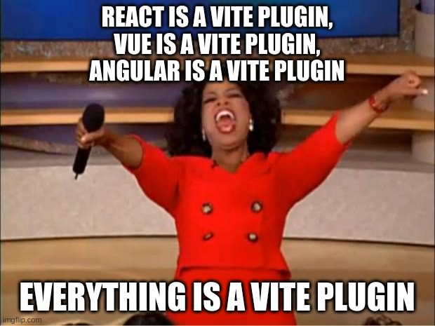


### Vite, c'est quoi ?

- 📦 un bundler (esm-based)
- 🔃 un serveur de développement (HMR)
---
- vite est un bundler, basé sur rollup
- lit vos fichiers pour en faire des "chunks" js.
- vite est un serveur de développement, qui utilise esbuild pour la compilation, fournit un hot-reload rapide


### Bundle-based bundlers
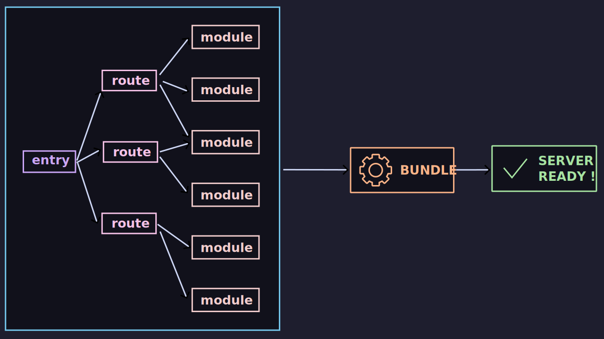

source: <https://vite.dev/guide/why.html>

---
- pourquoi vite c'est bien, et plus rapide
- webpack ou autres outils "historiques" faisaient comme ça.


### ESM-native bundlers
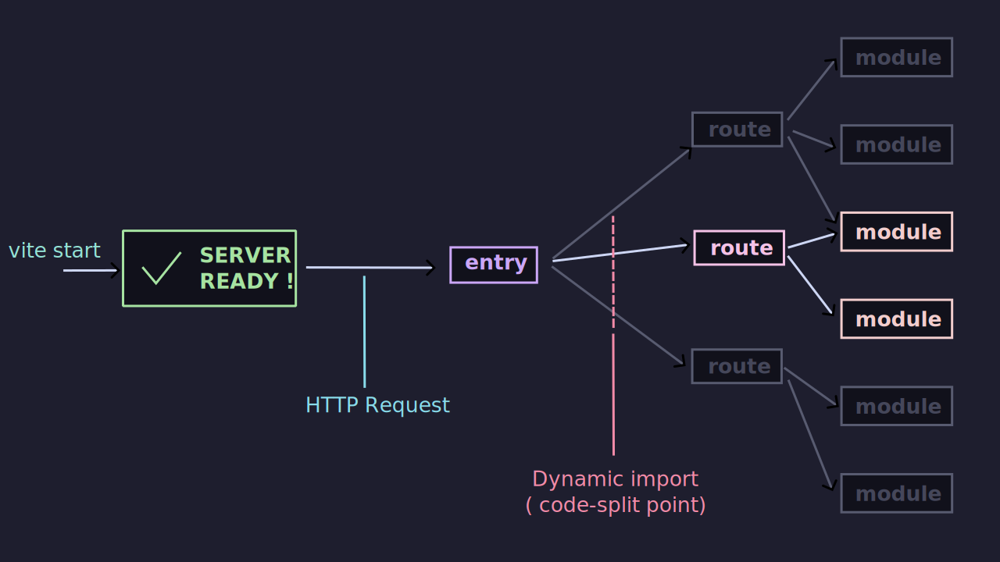

source: <https://vite.dev/guide/why.html>

---
- vite lit les imports et les résouds, à la demande. ( en mode dev )
- pas besoin de tout recompiler à chaque fois. 


### AnalogJS est un plugin vite.
- Vite s'occupe du build, plus uniquement tsc + angular + webpack.
- Angular devient utilisé en tant que "compilateur" par analogjs.
- Analog peut faire ce qu'il veut en amont.
---
- Pour simplifier


### Comment ça s'articule ?
`vite.config.ts`
```ts
import { defineConfig } from 'vite';
import analog from '@analogjs/platform';

export default defineConfig(({ mode }) => ({
  // ...
  plugins: [analog({
    // analog configuration
  })],
  // ...
}));
```
---
- quand vous générez un projet avec vite, vous avez un fichier vite.config.ts
- dans lequel vous déclarez un plugin vite ( ici analog )


`angular.json`
```json
{ 
  // ...
      "architect": {
        "build": {
          "builder": "@analogjs/platform:vite",
          // ...
        },
        "serve": {
          "builder": "@analogjs/platform:vite-dev-server",
          // ...
        },
        "test": {
          "builder": "@analogjs/platform:vitest"
        }
      }
  // ...
}
```
---
- analog fournit des plugins de build pour compiler votre appli angular
- utilise vite et le compilateur angular via les targets de la configuration Angular
- `ng serve` / `ng build` / `ng test` toujours utilisables
- si vous voulez utiliser vite et vitest sans utiliser les autres features d'angular, vous pouvez.


### Vitest
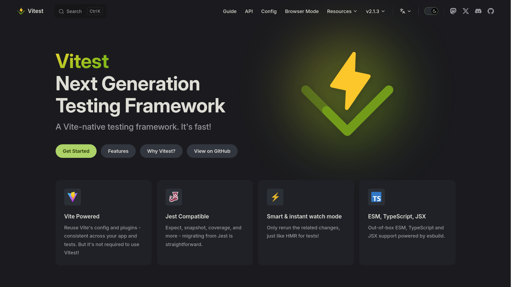

---
- Quelques mots sur vitest.
- vitest est un test runner basé sur vite 
- alternative à karma/jasmine/jest
- plus rapide, plus simple, plus moderne.
- si vous êtes full-esm déjà, et que vous en avez marre de jest+babel, vitest est pour vous.


### Vitest

- Vous pouvez utiliser Vitest sans analogjs sur un projet angular 


### D'autres intégrations
- NX - <https://nx.dev/>
- Playwright - <https://playwright.dev>
- Astro - <https://astro.build/>
- Markdown (with marked) - <https://marked.js.org/>
- Mermaid - <https://mermaid-js.github.io/mermaid/#/>
- Storybook - <https://storybook.js.org/>
- Ionic Framework - <https://ionicframework.com/>
- Material Design - <https://material.angular.io/>
---
- AnalogJS est un plugin Astro aussi
- analogjs a une forte dépendance à @nx qu'ils ont découplé un peu
- playwright pour les tests de bout en bout


## Et le serveur dans tout ça ?


### Hybrid SSR/SSG
- pré rendu statique (vite)
- rendu serveur "dynamique"<span class="fragment">(nitro)</span>

---
statique, hébergé sur un serveur stupide genre apache, nginx, s3 ou autres


### Nitro
Nitro - <https://nitro.unjs.io/>

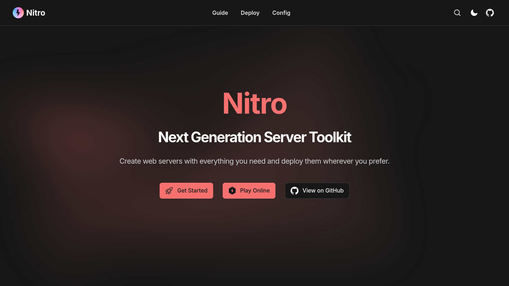

---
- par les gens derrière nuxt.js, c'est ce qui s'occupee du SSR de nuxt.
- même contributeurs.
- analogjs utilise nitro pour le serveur SSR.
- bon, eux ils appellents ça "toolkit", mais bon 
- en vrai c'est lui aussi un meta-framework regroupant un ensemble de librairies de l'écosystème UnJS


### h3 ⚡
<https://h3.unjs.io/>

- event handlers
- routes 
- websockets
- server-sent events
---
- pour simplifier, on va dire que c'est une alternative moderne à express


### Nitro y ajoute, par dessus
- file based routing
- auto imports
- connexion DB avec db0
- etc...
---
- de la même manière que pour nos pages front
- analogjs fournit un système ou on peut utiliser
- l'arborescence des répertoires pour définir nos routes


#### Définir des routes server avec analog
`src/server/routes` => `/api`
---
- Tout ce que vous mettez dans ce répertoire sera accessible via `/api`
- convention analogjs


`src/server/routes/v1/hello.ts`
```typescript
import { defineEventHandler } from 'h3';

export default defineEventHandler(() => {
  return { message: 'Hello World' }
});
```

`http get /api/v1/hello`<!-- .element: class="fragment" -->

---
- cet handler sera disponible par un GET /api/v1/hello


#### File-based routing

```no-highlight
src/server/routes
└── v1
    ├── users
    │   └── [id].get.ts  // GET /api/v1/users/{id}
    └── users.post.ts    // POST /api/v1/users
```
---
- Noter que le "type" .component.ts est le verbe http.
- pour moi ça fait sens, un fichier par route HTTP, c'est logique.


## Options de déploiement


### Zero config providers
- aws amplify
- azure
- cloudflare pages
- netlify
- stormkit
- vercel
- zeabur

source: <https://nitro.unjs.io/deploy>

---
- Selon les packages npm installés et l'environnement, nitro peut détecter sur quel cible déployer


### Presets nitro disponible
| | | | | | |
| - | - | - | - | - | - |
| Alwaysdata | AWS Lambda | AWS Amplify | Azure | Cleavr | Cloudflare |
| Deno Deploy | DigitalOcean | Edgio | Firebase | Flightcontrol | Genezio |
| GitHub Pages | GitLab Pages | Heroku | IIS | Koyeb | Netlify |
| Platform.sh | Render.com | StormKit | Vercel | Zeabur | Zerops |


### Bref.
- partie serveur gérée par nitro
- file-based routing pour les routes d'API
- déploiement sur plusieurs plateformes
- support de runtime alternatifs (deno, bun)


## One more thing...

- new component authoring format
---
- Vu qu'analog utilise déja le compilateur angular.
- Pourquoi ne pas utiliser les fichiers .ng pour définir nos composants angular ?
- Petit scandale / confusion, le nom de fichier prétant à confusion, la fonctionnalité a été revert ( dans un premier temps )
- Compréhension de texte. TwitterVerse "What If"
- Puis réintroduite sous le nom de fichier .analog
- risque de "leader d'opinion" sur tweeter qui sont en mode "what if?" et dont les tweets sont pris au sérieux.


### .analog files
`hello.analog`
```html
<template>
  <p>hello works!</p>
</template>
```
---
- Ceci est un composant angular avec AnalogJS
- Je vous laisse digérer l'information pour ceux qui connaissent angular.


### ts in .analog files
```html [|1-13|14-18|19-21]
<script lang="ts">
  import { signal } from '@angular/core';

  const counter = signal(1);

  const increment = () => {
    counter.update((value) => value + 1);
  };

  function decrement() {
    counter.update((value) => value - 1);
  }
</script>
<template>
  <p>Counter: {{ counter() }}</p>
  <button (click)="increment()">increment</button>
  <button (click)="decrement()">decrement</button>
</template>
<style>
  p { color: red }
</style>
```


### ts in .analog files
```html [|1|2-5|7-9|11-14|16-22|24-34|36-45|48-64|66-70]
<script lang="ts">
  import { inject, signal, effect, computed } from '@angular/core';
  import { JsonPipe } from '@angular/common';
  import { HttpClient } from '@angular/common/http';
  import { delay } from 'rxjs';

  import Hello from './hello.ng';
  import Highlight from './highlight.ng';
  import Doubled from './doubled.ng';

  defineMetadata({
    selector: 'app-root',
    imports: [JsonPipe],
  });

  const title = 'Analog';

  const http = inject(HttpClient);

  const counter = signal(1);
  const doubled = computed(() => counter() * 2);
  const todo = signal(null);

  const increment = () => {
    counter.update((value) => value + 1);
  };

  function decrement() {
    counter.update((value) => value - 1);
  }

  effect(() => {
    console.log('counter changed', counter());
  });

  onInit(() => {
    console.log('App init');
    http
      .get('https://jsonplaceholder.typicode.com/todos/1')
      .pipe(delay(2000))
      .subscribe((data) => {
        todo.set(data);
        console.log('data', data);
      });
  });
</script>

<template>
  @if (counter() > 2) {
    <Hello />
  }

  <p>Counter: {{ counter() }}</p>
  <p highlight>Doubled: {{ doubled() }}</p>
  <p>Doubled with Pipe: {{ counter() | doubled }}</p>
  <button (click)="increment()">increment</button>
  <button (click)="decrement()">decrement</button>

  @if (todo(); as todo) {
  <pre>{{todo | json }}</pre>
  } @else {
  <p>Loading todo...</p>
  }
</template>

<style>
  p {
    color: red;
  }
</style>
```


### Vue.js called

- They want their ~~shirt~~ component authoring format back.
---
- En vrai c'est trop bien


### Pre-shot des critiques du Single File Component.

- Oui mais la séparation des préoccupations ?
- (SRP) Single Responsability Principle<!-- .element: class="fragment" -->


---
- SRP: chaque fichier contient tout ce qui est nécessaire pour le composant, son style et son comportement.
- la responsabilité de la structure, vs la responsabilité de l'apparence, vs la responsabilité du comportement
- = c'est une seule responsabilité, celle du composant, découpez pas par responsabilité "technique", c'est pas le but.
- surtout ça permet de la:


### Colocation de code
- Ce qui change souvent ensemble, est localisé au même endroit.


### Même sans .analog, faites des SFC,<br/>c'est bon pour la santé.
```Typescript
@Component({
  selector: 'my-component',
  standalone: true,
  template: `
    <h1>Hello {{ name() }}</h1>
  `,
  styles: [`
    h1 { color: red; }
  `],
})
class MyComponent {
  name = signal('World');
}
```
---
- Vous pouvez déjà faire du single file component en angular nativement, et c'est bon, mangez-en.


### Experimental !

```typescript [|11]
import { defineConfig } from 'vite';
import analog from '@analogjs/platform';

export default defineConfig(({ mode }) => ({
  // ... other config
  plugins: [
    analog({
      ssr: false,
      vite: {
        experimental: {
          supportAnalogFormat: true
        }
      },
    }),
  ],
}));
```
---
- à noter que ce format .analog est encore une feature expérimentale
- il faut s'attendre à ce que l'api change encore. Ou soit encore revert ?


## Conclusion

- étonnant, non ?
- la DX de vue/nuxt.js pour angular<!-- .element: class="fragment" -->
- "convergence" des frameworks<!-- .element: class="fragment" -->
- AnalogJS = Angular + Vite + Nitro<!-- .element: class="fragment" -->

---
- Je vous encourage à tester analogjs, c'est vraiment cool.
- l'expérience de développement est grandement améliorée
- conventions à apprendre certes, mais ça vaut le coup, derrière: efficacité et rapidité


## Conclusion (bis)
- Convention over configuration<!-- .element: class="fragment" -->
- Mais explicitez vos conventions<!-- .element: class="fragment" -->
- Les abstractions c'est bien<!-- .element: class="fragment" -->
- c'est encore mieux quand on sait de quoi on s'abstrait<!-- .element: class="fragment" -->


### cas d'usage ou AnalogJS est intéressant
- quand vous avez déja une base de code Angular<!-- .element: class="fragment" -->
- quand vous avez déjà des connaissances Angular<!-- .element: class="fragment" -->
- 😏 sinon, utilisez vue + nuxt<!-- .element: class="fragment" -->

---
- évidemment c'est mieux si vous avez déja une base de code angular 
- si vous avez déja des connaissances Angular


### cas d'usage ou AnalogJS est intéressant
- pour des sites techniques (documentation, blogs)<!-- .element: class="fragment" -->
- pour des sites à fort contenu texte peu contribuables<!-- .element: class="fragment" -->

---
- grâce à markdown + mermaid et la coloration syntaxique, on peut facilement faire des sites de documentation
- permets de se concentrer sur le contenu.
- si pas de besoin de contribuer, pas besoin de CMS


## Questions

?


## Et merci
<div class="row">
  <div class="col" style="flex: 1 1 auto">
    <a href="https://openfeedback.io/devfestnantes24/2024-10-17/analogjslemetaframeworkpourangular" target="_blank">
      
    </a>
    <h3>⬆️  Feedback  ⬆️</h3>
  </div>
<div style="width: 20%">
    <p style="font-size:18px">Easter egg pas caché<br/>"beyond the phobia":<br/> <code style="display:inline">meta-cagoule</code></p>
    
</div>
</div>

